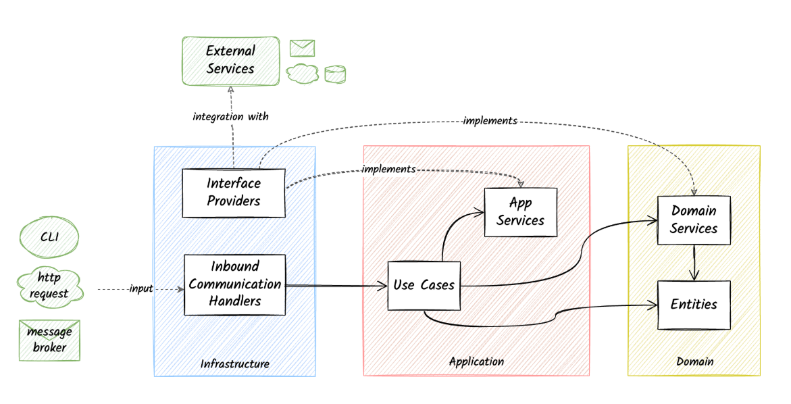

# GlobalWebIndex – Favorites Service

A production-oriented implementation of the GWI engineering challenge.  
This service manages **user favorites** for various assets (Charts, Insights, Audiences)  
and provides a complete REST API with authentication, role-based authorization, and CRUD operations.

---

## 📑 Table of Contents

1. [Overview](#overview)
2. [Architecture](#architecture)
3. [Features](#features)
4. [Tech Stack](#tech-stack)
5. [Running Locally](#running-locally)
6. [Docker Usage](#docker-usage)
7. [Authentication Flow](#authentication-flow)
8. [API Reference](#api-reference)
9. [cURL Examples](#curl-examples)
10. [Testing](#testing)
11. [Swagger Documentation](#swagger-documentation)
12. [Storage Discussion](#storage-discussion)
13. [Improvements](#improvements)

---

## ⭐ Overview

This service allows users to maintain a personalized list of **favorite assets**.  
Assets can be:

- **Chart**
- **Insight**
- **Audience**

Users can:

- Retrieve all favorites
- Add favorites
- Patch & update
- Delete
- Authenticate via JWT

Data is stored **in-memory** for the purpose of the challenge, but the architecture supports easy migration to a persistent database.

---

# Code Design


---

**Project Structure**

It follows the group-by-layer structure:

```bash
├── go-climb
│   ├── cmd/
│   ├── docs/
│   ├── internal
│   ├── app
│   │   ├── favourite
│   │   │   ├── commands
│   │   │   └── queries
│   │   ├── notification
│   │   │   ├── mock_notification.go
│   │   │   └── notification.go
│   │   ├── services.go
│   │   └── services_test.go
│   ├── domain
│   │   └── favourite
│   │       ├── favourite.go
│   │       ├── mock_repository.go
│   │       └── repository.go
│   ├── infra
│   │   ├── http
│   │   │   ├── favourite
│   │   │   └── server.go
│   │   ├── notification
│   │   │   └── console
│   │   ├── services.go
│   │   └── storage
│   │       ├── memory
│   │       └── mysql
|   │   └── pkg
|   │       ├── time/
|   │       └── uuid/
│   └── vendor/
```
- `cmd` contains the `main.go` file, the entry point of the application
- `docs` contains documentation about the application
- `internal` contains the main implementation of our application. It consists of the three layers of clean architecture + shared utility code under `pkg/`
- infra
- app
- domain
- pkg

Each of these directories contains its corresponding components, following the group-by-feature approach.
- `vendor` contains the dependencies of our project


## Developer's Handbook
```makefile
make run  ## Run the application
make lint  ## Perform linting
make test  ## Run unit tests
make build  ## Build the app executable for Linux
make fmt  ## Format the source code
```

## ✨ Features

- Full REST API for managing user favorites
- JWT authentication (access + refresh tokens)
- Role-based authorization (admin routes)
- Clean architecture with clear domain boundaries
- UUID validation & strict input checks
- Notifications upon favorite creation
- Consistent JSON error responses
- Fully containerized (Dockerfile included)
- Unit-testable domain logic
- In-memory storage for simplicity (easily replaceable)

---

## 🧱 Tech Stack

- **Go 1.24**
- Gorilla Mux – routing
- Google UUID – ID handling
- Golang-JWT – authentication
- Testify – testing
- Docker – containerization

---

## ▶️ Running Locally

```bash
go mod tidy
go run ./cmd/main.go
```

Server runs at:

http://localhost:8080

## 🐳 Docker Usage - Build image
```bash

docker build -t gwi-favorites .
```

### Run container
```bash
docker run -p 8080:8080 gwi-favorites
```

# 🔐 Authentication Flow

### User Login
1. User logs in using `/login`.
2. Server returns:
    - `access_token`
    - `refresh_token`
3. Access token is included in subsequent requests:
   
   - `Authorization: Bearer <access_token>`
4. When the access token expires, the client calls `/refresh`.

---

## 📘 API Reference

### 🔑 Authentication Endpoints

| Method | Endpoint | Description |
|--------|----------|------------|
| POST   | `/login` | Authenticate & get tokens |
| POST   | `/refresh` | Generate new access token |
| POST   | `/logout` | Invalidate refresh token |

### ⭐ Favorite Endpoints (JWT required)

| Method | Endpoint | Description |
|--------|----------|------------|
| GET    | `/users/{userID}/favorites` | Get all favorites |
| GET    | `/users/{userID}/favorites/{favoriteId}` | Get favorite by ID |
| POST   | `/users/{userID}/favorites` | Create new favorite |
| PATCH  | `/users/{userID}/favorites/{favoriteId}` | Update favorite description |
| PUT    | `/users/{userID}/favorites/{favoriteId}` | Full update of a favorite |
| DELETE | `/users/{userID}/favorites/{favoriteId}` | Delete favorite |

---

## 💻 cURL Examples

### Login
```bash
curl -X POST http://localhost:8080/login \
-H "Content-Type: application/json" \
-d '{"username":"alice","password":"password1"}'
```
### Refresh Token
```bash
curl -X POST http://localhost:8080/refresh \
  -H "Content-Type: application/json" \
  -d '{"refresh_token":"<token>"}'
```
## Favorites API Reference

### 💻 cURL Examples


curl -X GET "http://localhost:8080/users/<userID>/favorites" \
-H "Authorization: Bearer <access_token>"

curl -X GET "http://localhost:8080/users/<userID>/favorites/<favoriteId>" \
-H "Authorization: Bearer <access_token>"

curl -X POST "http://localhost:8080/users/<userID>/favorites" \
-H "Authorization: Bearer <access_token>" \
-H "Content-Type: application/json" \
-d '{
"type": "chart",
"description": "Daily social media hours",
"data": {"x":"hours","y":"distribution"}
}'

curl -X PATCH "http://localhost:8080/users/<userID>/favorites/<favoriteId>" \
-H "Authorization: Bearer <access_token>" \
-H "Content-Type: application/json" \
-d '{"description":"Updated favorite"}'

curl -X PUT "http://localhost:8080/users/<userID>/favorites/<favoriteId>" \
-H "Authorization: Bearer <access_token>" \
-H "Content-Type: application/json" \
-d '{
"type": "insight",
"description": "40% of millennials...",
"data": {}
}'

curl -X DELETE "http://localhost:8080/users/<userID>/favorites/<favoriteId>" \
-H "Authorization: Bearer <access_token>"

## 🧪 Testing
go test ./...

### 🗄 Storage Discussion
**Current:** In-memory Maps
- Ultra-fast
- No persistence
- Perfect for challenge constraints

**Real-world Options:**

| Storage   | Why |
|-----------|-----|
| Postgres  | Strong consistency, relational favorites |
| Redis     | High-speed caching for user favorites |
| MongoDB   | Flexible JSON-like storage for asset types |
| DynamoDB  | Fully managed, scalable, event-driven |
| CQRS/ES   | Ideal for high-write workloads |

## 🚀 Improvements & Future Enhancements
- Switch to Postgres or Redis-backed storage
- Add Prometheus metrics + Grafana dashboards
- Graceful shutdown + health checks
- Observability via OpenTelemetry
- Background notifications worker
- Rate limiting (per-user API quotas)
- Pagination of favorites
- Soft deletes / audit logs
- Complete CI/CD pipeline
- Add swagger doc
